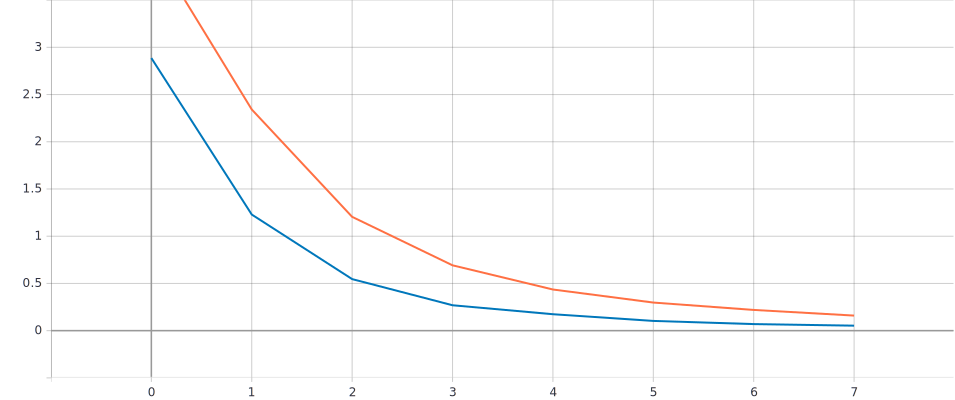
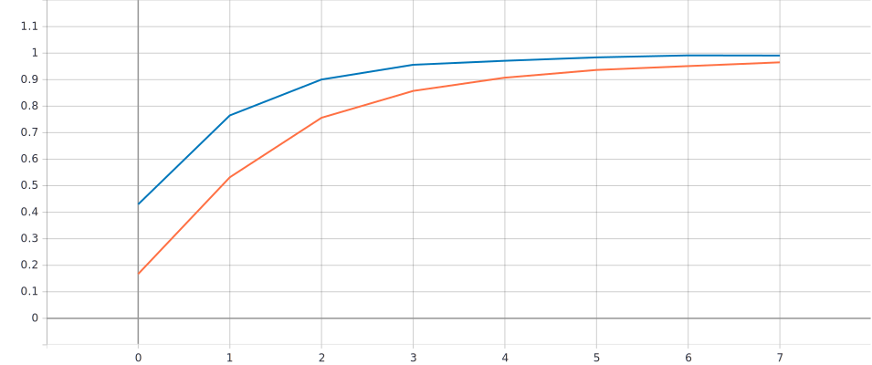

# flowers102-recognition
- Deep Learning
- Convolutional Neural Network
- Transfer Learning
- Data Augmentation 
- EfficientNets (state-of-the-art)

-  `validation loss`
-  `training loss`

-  `validation accuracy`
-  `training accuracy`

- combined graph

